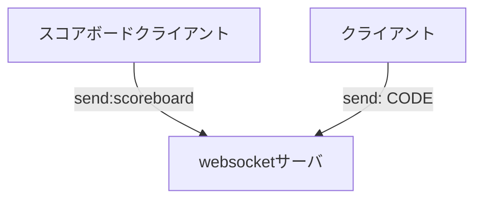

# 欽ちゃんの仮装大賞パネル 再現アプリ WebSocket対応版

オリジナルは https://kinchan.toriiico.com/

## 謝辞および免責事項

オリジナルについては https://kinchan.toriiico.com/ の作者にその権利が帰属します。

@ytnobodyはWebSocket対応版について作成しましたが、WebSocket対応版についてもオリジナルをコピー・改変したものとなりますので、オリジナルのライセンス如何によっては公開・利用に関する制約を受ける可能性が生じ得ます。

当ドキュメント執筆時点(2024-02-15)ではオリジナルのライセンスについては記載なしのため、MITライセンスに相当するものと仮定しておりますが、オリジナルのライセンスが明確化した暁には、基本的にはその内容に従う前提です。

## 依存パッケージのインストールと起動

```
pnpm install
pnpm start
```

## 待ち受けポート番号

```
Webサイト:
http://localhost:8000

websocket:
ws://localhost:8080
```

## websocket上のイベント

### code

```
code:[SOME_CODE]
```

- websocketサーバはクライアントの接続ごとに一意なコードを払い出します。
- クライアントはこのコードを、投票のために保存する必要があります。

### vote

```
[SOME_CODE]
```

- クライアントは自身が保存しているコードを送信することで1票を投票できます。
- websocketサーバはコードを受け取り、その票数をカウントします。

### increment

```
increment
```

- websocketサーバは得票数を加算するたびに `increment` をすべてのクライアントに送信します。
- スコアボードクライアントは `increment` を受け取ると、スコアボード内のスコアを加算します。

### scoreboard

```
scoreboard
```

- スコアボードクライアントはwebsocketサーバへの接続後に `scoreboard` を送ります。
- websocketサーバは `scoreboard` を送ってきたクライアントのIDを記録し、スコアボードクライアントとして識別します。

### reset

```
reset
```

- websocketサーバは `reset` を受け取ると得票数を0にします。
- websocketサーバは得票数を0にするときに `reset` をスコアボードクライアントに送ります。


## コンポーネント


