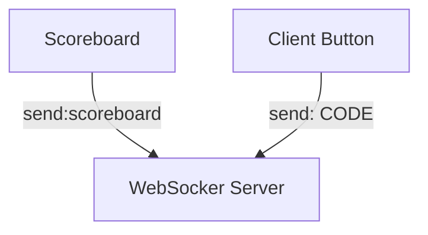

```
pnpm install
pnpm start
```


```
static:
http://localhost:8000

websocket:
ws://localhost:8080
```

## protocol on websocket

### code

```
code:[SOME_CODE]
```

- The WebSocket server issues the code necessary for voting when a client connects.
- The client needs to use this code for voting, so this code needs to be saved for that purpose.

### vote

```
[SOME_CODE]
```

- The client sends the code to the WebSocket server.
- The WebSocket server receives the code and counts the vote.

### increment

```
increment
```

- The WebSocket server sends `increment` as a broadcast to all clients.
- The Scoreboard client receives `increment` and increments the score.

### scoreboard

```
scoreboard
```

- The Scoreboard client sends `scoreboard` to the WebSocket server when it connects.
- The WebSocket server keeps client id of the Scoreboard client.

### reset

```
reset
```

- The WebSocket server receives `reset` and resets the score.
- The WebSocket server sends `reset` to the Scoreboard client.


## components

